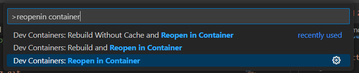
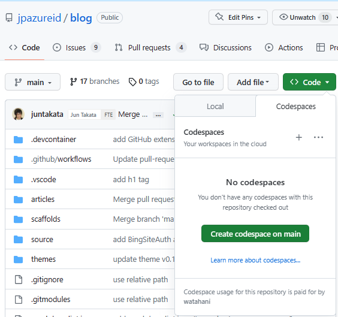

# Japan Dynamics ERP Support Team Blog

日本マイクロソフトの Dynamics ERP テクニカル サポート チームが運営する技術ブログのソースリポジトリです。

- 公開サイト: https://jpd365erpsup.github.io/blog/
- 生成エンジン: [Hexo](https://hexo.io/)（テーマ: [jpazureid/hexo-theme-jpazure](https://github.com/jpazureid/hexo-theme-jpazure)）

サイトは GitHub Actions により `gh-pages` ブランチへビルド・配信されます。

## Getting Started

ローカルでの執筆環境やプレビュー手順は [docs/getting-started.md](./docs/getting-started.md) を参照してください。

## Initialize / Update blog theme

テーマは git submodule で管理しています。

```shell
git submodule update -i
```

## Start / Stop Hexo server (local preview)

ローカルプレビューは Docker で起動します。`http://localhost:4000/` で確認できます。

```shell
docker-compose up

# 停止は Ctrl+C のあと
docker-compose down
```

## Writing in a Dev Container

Dev Container で執筆する場合は、Visual Studio Code と [Dev Containers 拡張](https://marketplace.visualstudio.com/items?itemName=ms-vscode-remote.remote-containers) をインストールし、コマンドパレットから `Reopen in Container` を選択します。



Dev Container 内では `F5`（Run and Debug）で Hexo サーバーを起動できます。

GitHub Codespaces でも同じ Dev Container を利用できます。リポジトリの `Code` -> `Codespaces` -> `Create codespace on main` を選択します。



## Directory structure

```
blog
├── .devcontainer       # Dev Container / Codespaces 設定
├── .github
│   └── workflows       # GitHub Actions ワークフロー
├── .vscode             # 推奨拡張・textlint/markdownlint 設定・スニペット
├── .gitignore
├── .textlintrc
├── postCreateCommand.sh # Dev Container 作成時に実行されるスクリプト
├── README.md
├── _config.yml         # Hexo サイト設定
├── articles            # ブログ記事（ルートタグ別フォルダ）
├── docker-compose.yaml # ローカルプレビュー用コンテナ設定
├── docs                # ドキュメント
├── github-issue-template.md
├── scaffolds           # 記事テンプレート
├── source              # 静的アセット
└── themes
    └── jpazure         # ブログテーマ（git submodule）
```

## Writing articles

記事は `articles/{root-tag}/{slug}.md` に配置し、画像は同名フォルダ `articles/{root-tag}/{slug}/` に置いて相対パスで参照します。ルートタグは [_config.yml](./_config.yml) の `root_tag_generator` で定義しています。
