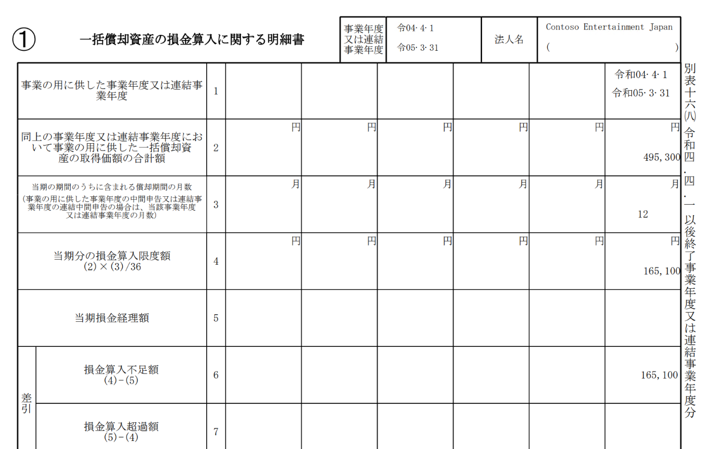
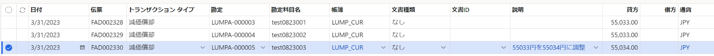

こんにちは、Dynamics ERP サポートチームの永吉です。  
この記事では、Dynamics 365 Finance の日本向けローカライゼーション機能である一括償却資産の償却について紹介します。

<!-- more -->
## 検証に用いた製品・バージョン:
Dynamics 365 Finance and Operations  
Application version: 10.0.43  
Platform version: PU 51  
Legal entity: JPMF 

# 固定資産の作成、取得

一括償却資産の作成と取得を行います。

# 当期分の損金算入限度額の確認

別表 16-8 レポートを出力し、当期の損金算入限度額を確認します。別表 16-8 レポートの出力方法は以下のようになります。
1. [固定資産] > [照会およびレポート] > [法人税別表 16 シリーズ] > [別表 8 レポート] を起動
1. パラメーターを選択して実行
一括償却資産の取得価額の合計額 (項目2) より算出された当期の損金算入限度額 (項目4) を確認します。

# 償却提案の作成
        
当期の償却提案を行います。
1. [固定資産] > [仕訳入力] > [固定資産仕訳帳] を起動
1. [新規] より減価償却用の仕訳行を作成後、[明細行] をクリック
1. [提案] > [償却提案] より固定資産グループ等の条件を使用して一括償却資産に対象を絞り、償却提案を実行
1. 作成された減価償却金額と、確認した当期分の損金算入限度額の差額を調整  
調整を行った対象を追跡可能とするため、説明欄に調整内容等を記載します。
   

# おわりに  
以上、一括償却資産の減価償却手順における調整手順についてご紹介しました。
一括償却資産の総額から当期の償却額を算出する方法について現在弊社にて修正を検討中でございます。
