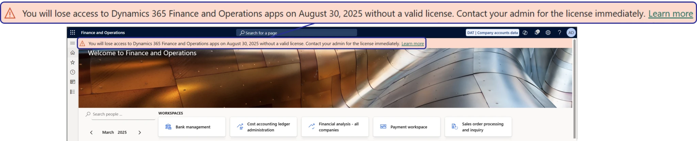
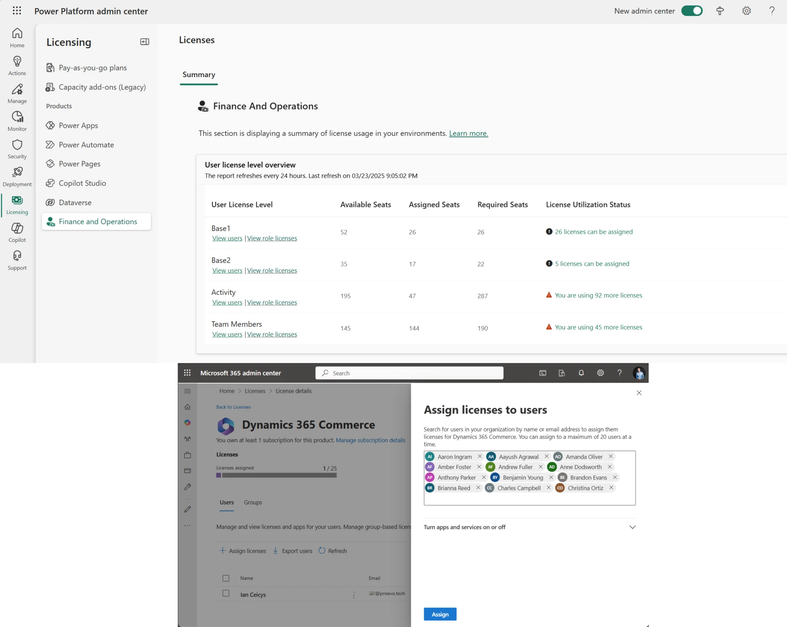
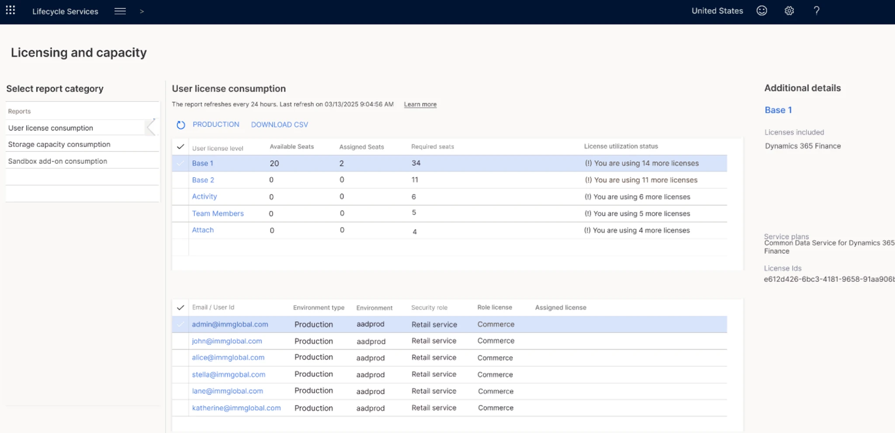

こんにちは、Dynamics 365 ERP サポートチームです。
本記事は、2025 年 3 月 28 日に Dynamics 365 Blog で公開された英語記事 [Simplifying License Management for Dynamics 365 Finance and Operations: Improved User License Validation](https://www.microsoft.com/en-us/dynamics-365/blog/it-professional/2025/03/28/simplifying-license-management-dynamics-365/) を基にしたものです。

今までは、ライセンスが付与されていないユーザーでも Dynamics 365 Finance and Operations アプリケーションにアクセスできていましたが、
今後、ライセンスが付与されていないユーザーは Dynamics 365 Finance and Operations アプリケーションにアクセスできなくなりますのでご注意ください。

ご不明点はサポート チームまでお問い合わせください。

<!-- more -->
---
Dynamics 365 Finance and Operations のユーザーライセンス管理を一元化し、管理者にとってわかりやすくするためのアップデートをご紹介します。

> [!NOTE]
> 以下の弊社公開資料にて、よくある質問 (FAQ) を公開しましたので、ぜひご確認ください。
> 
> https://learn.microsoft.com/en-us/dynamics365/fin-ops-core/fin-ops/sysadmin/user-security-report-technical-validation-faq

2025 年 4 月 30 日以降、まだライセンスが割り当てられていないユーザーには、ライセンス割り当てをリクエストするために管理者に連絡するよう求める製品内通知が表示されるようになる予定です。

 

2025 年 8 月 30 日以降、Dynamics 365 Finance and Operations にアクセスするには、割り当てられたライセンスが必要になる予定です。すでにライセンスが割り当てられているユーザーについては、混乱はなく、管理者からのアクションも必要ありません。  

以下のアクションを実施いただくことで準備することができます。
1. Power Platform 管理センターで [Finance and Operations User license level overview report](https://admin.powerplatform.microsoft.com/billing/licenses/financeAndOperations/overview) を確認してください。
2. Microsoft 365 管理センターで Dynamics 365 ライセンスの割り当てを開始してください。

また、(1) Power Platform 管理センター、(2) LCS、 (3) Dynamics 365 Finance and Operations 内 にて、利用できるライセンスレポート機能が改善され、管理者はライセンスをよりよく理解し、管理できるようになりました。

(1) Power Platform 管理センターにて以下のようなレポートが利用できます。
 

(2) LCS にて以下のようなレポートが利用できるようになる予定です。
 

(3) Dynamics 365 Finance and Operations の バージョン 10.0.43 では、[ユーザーセキュリティガバナンス](https://learn.microsoft.com/en-us/dynamics365/fin-ops-core/fin-ops/sysadmin/security-gov-overview)がパブリックプレビューとなり、管理者はより優れた可視性とコントロールを利用できるようになりました。
これらの機能の一般提供は、バージョン 10.0.44 で 2025 年 7 月を予定しています。 顧客は、機能管理を通じてこれらの機能を選択し、サンドボックス環境でテストすることができます。

---
## おわりに  

以上、 2025 年 3 月 28 日に Dynamics 365 Blog で公開された英語記事 [Simplifying License Management for Dynamics 365 Finance and Operations: Improved User License Validation](https://www.microsoft.com/en-us/dynamics-365/blog/it-professional/2025/03/28/simplifying-license-management-dynamics-365/) を基にした、Dynamics 365 Finance and Operations のライセンスの重要な変更点についてお知らせしました。
なお、上記の通知やアクセス不可が適用される日付はあくまで現時点での予定となり、予告なしに変更されることがございます。